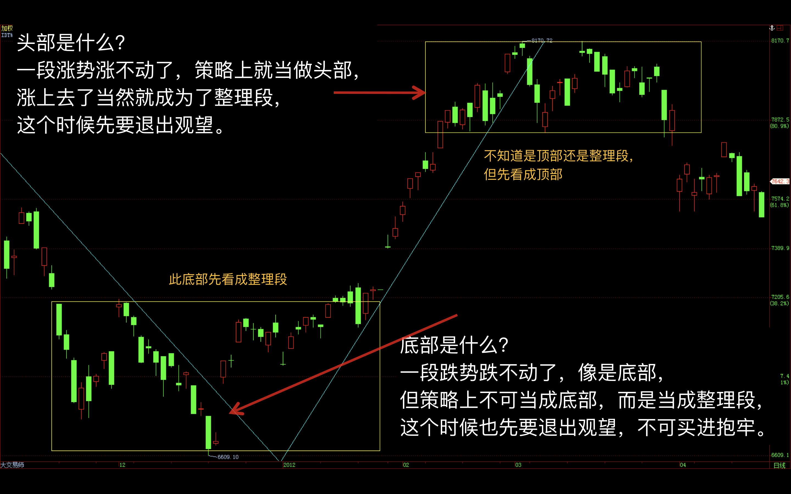
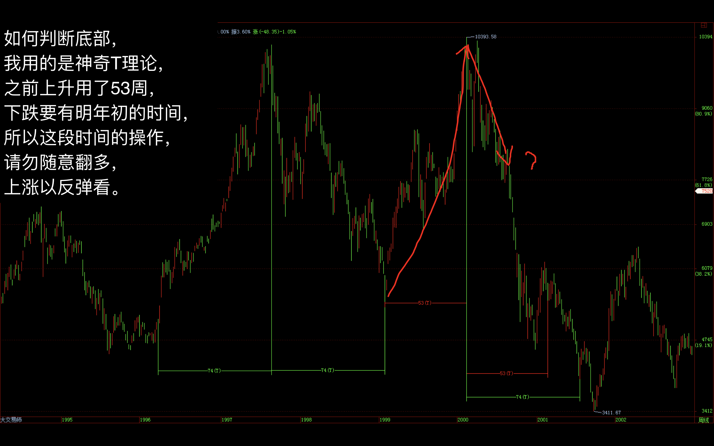
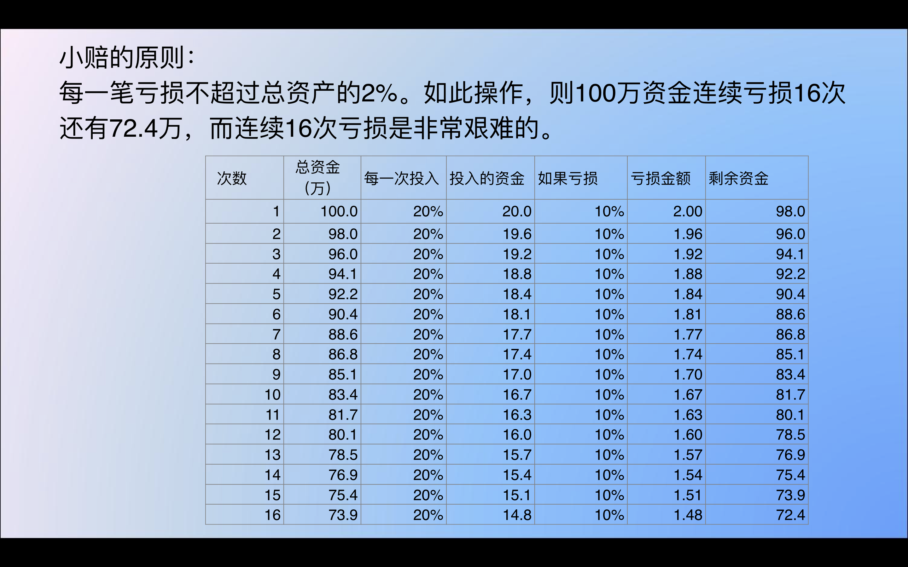

刀疤老二策略

1. 你的策略能够抓住几次大行情，
2. 避开大亏损，
3. 不怕平时小额的亏损。

操作的大原则：

- 上升趋势逢回档皆做多

- 下降趋势逢反弹都做空

- 再有钱的大户，与市场作对，一定赔！

- 底部在哪，重要吗？

  根本不重要。不用知道，也没人知道。  专心在自己的买卖点上，
  何时该加码，  何时该止损……

- 怎么选择是做多还是做空？

  衡量标准是风报比，是上涨的利润大，  还是下跌的利润多。
  这里已经下跌2500点了，  如果看到还有大的下跌空间,  就该做空！

- 风报比三比一， 是进场的起码要求。
  500点的行情不难赚到，  每个月大概至少出现一次

- 高手为什么厉害？
  就是他可以承受不断的犯错。  但是一笔大盈利就远远超过  以前加起来的亏损。
  超高报酬率的“高手”成功的关键是  将“加码”用到淋漓尽致！
  只要利润显现，趋势浮现，就该加码。

- 多头市场不会因为几天大跌就变成空头市场，
  空头市场不会因为几天大涨就变成多头市场。

- 一次长线可以让资产增加十倍:
	长线依靠的主要是策略和几次大的绩效，
   	当然长线判断要有某种程度，不能太离谱。
    	做短线依靠的是准确率，每天密切盯盘，容易掉头发；

- 盘整时做短线，趋势明显时做长线。

- 头部判断

- 底部判断
 

- 资金分配

- 玩个股一定要看大盘
板块轮跌时，慢性盘跌，今天板块一起跌，就是崩盘
trend明显时，他动用他大部份资金，不断加码
trend不明显时，只动用少数资金，短线少量进出，他的目的是不想失去对市场的感觉。

- 重视我所有亏损的任何一次交易
我常常会把所有错误交易，很痛的从记忆中拿出来，清醒的告诉自己，所犯错误的愚蠢，我期许自己不能再犯，因为我想要成功，我不能再走失败的路...我的自信来自于我的失败！

- 风险不是在现在才要衡量啊，预防胜于治疗！
- 永远记住这次教训，永不在犯，才是长久之计

- “不要迷失在预测行情上了”。
能成功预测行情的人，不一定就就能赚钱，因为，能成功预测行情，但不敢拿金钱下去大力操作的情形，占了绝大部份... 

- 真正赚钱秘诀，不在“转折点的预测”，而在于“顺势加码”，
在于赚时，让它赚到翻！我想，大部份人，都是进去3个部位，出来3个部位，所以赚钱的报酬率，取决于“选股选的好不好”，但会运用加码的人，可以将某个不起眼的报酬率大幅提升！只要利润显现，趋势浮现，就该加码... 
 可以想想，如果今年初，波段展开时，就利用加码的方式，应用在那些“正开始”展现利润的部位，而不是一赚钱就赶紧了结“找寻下个好标的”，报酬率是否就大幅提升！？不用去跟人家比，联电几元进，几元出，或想说，买的低的就很强，或卖到最高价就是神。对于同样是70进，100出，老手可能赚的比一般人多“好几倍”，买很低看起来很厉害，但不代表就赚的多，因为这个部位可能很小...

- 这也牵扯到心理面，用顺势加码时，不会再执着于某一笔“神奇交易”
所以克服了“死赌”的天性，也减少了“深怕错过”的惶恐感，“停损执行”就不再那么困难，因为每一笔都有很好的机会发展出大利润... 
那么在何处加码最有利呢？ 嗯，自己找吧，找到对自己最合适的，运用它！ 
-  当然这个方法，加上停损执行，真的是太棒了
就我知道，那些“不可思议超高报酬率的操作之神”，成功关键就在将“加码”用到淋漓尽致，而不是“努力预测反转点，希望赚到整段所有利润” ！！

- 试着将大盘k线图自己用笔画画看，
看看一路画下来到7000点比较自然，还是将它往上弯到1万2比较自然？

- 停损有很多种方法
价格停损、时间停损、总资金停损、单笔最高忍受停损...
价格停损是最多人用的

- 要诀是“停损不要设在行情可以轻易到达处”；
- 时间停损，高手多半爱用这种方式，因为他对行情了若指掌；
- 总资金停损，例如停损为总资金的2%；
- 单笔最高容忍停损，例如停损为单笔投入资金之10%。
以上方式，可以混合着用，例如我拿100万出来玩，一次单笔，我只拿20万出来建立部位，我设停损在赔掉2万元，无论如何就得出场，所以我单笔的损失最多是10%，对总资金而言，一次停损最多赔掉2%...假设不幸第一次看错行情，停损出场，我赔掉了2万元，总资金剩下98万，下次，我最多一笔只能赔1.96万...最多还是赔2%，依此类推... 

这样的方式，好处是，“不怕看错行情”，我可以连续不断看错行情，都不会赔光，重点是“越赔越少”，完全针对风险建立的停损系统。 

- 绝不能在有亏损时，扩大部位的建立，反而要相反，
要减少下次部位的资金，而如果有利润时，反而要加码！这就是我之前提的“顺势加码”，只在有利润时，才可以加码，越加越少，即使加码途中行情反转，只是少赚，不会赔。

- 强力建议多花心思于此处，而不是花太多时间在“预测行情上” ，花时间在“风险控管”才能事半功倍！
 看的准又如何，一次才赚5万，一次不准赔掉30万，如此，“判断准确率”不超过85%，绝不可能赚钱，更何况我们的“正确率”常低于5成... 

- 有句操作名言，“永远不要加码亏损的部位”，这句话，太太重要了，但却是最多人忽略的。我想这波下跌，很多人有深深的感受。换言之，“永远只加码赚钱的部位”，这句话的精神就在于，“不让你的亏损部位有机会呈倍数成长”，因为我们的资金是有限的，我们的判断不可能100%正确，为了考量风险，我们必须如此做。 

- 研究盘势，只有一个目的，那就是找寻交易机会，
永远将潜在利润与风险做为最大考量，不要对中间的小亏损斤斤计较，整个交易系统才是你要放最多心思的地方。**

- 下面是风报比为1：3时，交易进出为10次的盈亏情形

   > 停损为100点，假设只做一口单
   >
   > 0胜：-1000点 = -20万
   >
   > 1胜9负：-600点 = -12万 
   >
   > 2胜8负：-200点= -4万
   >
   > 3 胜7 负： 200 点  = 4 万 (扣掉交易成本约2.5万还有赚)
   >
   > 4 胜6 负： 600 点  **= 12 万** 
   >
   > 5 胜5 负： 1000 点  **= 20 万** 
   >
   > 6胜4 负： 1400 点  **= 28 万**  
   >
   > 7 胜 3 负： 1800 点   = 36 万  
   >
   > 8 胜 2 负： 2200 点  **= 44万** 
   >
   > 9 胜 1 负： 2600 点  **= 52 万** 
   >
   > 10 胜： 3000 点 = 60 万 

   由上面得知，10次交易只要赢2次，亏损就会大幅减少，换言之，假设平均一个月进出10次，目标只要放在3胜即可，接下来都是获利，甚至于，我很肉脚，这个月进出10次全杠龟，只要某个月出现5胜5负，则又打平了。在这样的系统架构下，我们才会有较佳的获利机会。因为每个人的资金大小不同，操作风格也不同，能忍受的风险也不同，操作周期长短也不同，所以每个人自

风报比这很棒的概念能用在交易上，是由伟大的Victor在专业投机原理上提出，此人连赚18年，平均每年72%报酬率，其中有5年赚100%以上

 我建议用所谓的“3批法则”，部位分3次建立，每隔数天建1口部位这样做的目的是让心理压力减至最低，试想如果当天他只先做1口，帐面即使亏损2万多，但和四口的10万，心理压力是完全不同的，如果隔天一开高100点(没有不可能的事)，4口单马上亏损扩大为20万，如何“自由自在的操作”呢？要砍也砍不掉，要分批认赔还会不甘心。如果只先做一口单，即使发生亏损，要砍也可以马上砍掉，因为亏损尚小。这是我在之前提过的“将部份利润拿来弥补可能发生的损失”。当然，一次做满的瞬间风险太大了，分批建立部位也在分散看错时所产生的风险。

在赢家的操作绩效表里，只有一种模式“大赚小赔”，只要能保持大赚小赔，多笔进出下，机率会带领你迈向成功之路，否则，都是输家。司马相的例子又要再提一次，这样一个技术分析已达某种境界的人(他满厉害的)，仍然会因一次意外而翻船，因为它的绩效表是，很多次赚，一次超级大赔，赔光一切，这无关技术分析功力的高低，而是资金控管出了大问题。

我的操盘法会是这样：既然我是看到5000点，表示我是看空长线的趋势，当然我就是操长线，别怀疑，期指可以拿来操长线，而且比你想象中的还神奇。

1. 首先我在9000点放空一口期指，停损设在9100，所以如果我停损了就赔2万，潜在风险约4%，也就是说，如果第一笔停损，损失资金的4%，可以接受；
2. 如果停损那就再找空点，注意，我强调过，只要我是看空的，就算我停损我还是会再进场找机会放空；除非你发现你错了，而更改了你看空的看法；
3. 如果有利润出现(也就是出现向下的跌势)，那表示到目前为止，我都是对的，如同未判罪之前，都要假设被告是无罪的。同样的，目前已经有下跌势开始出现，你当然得假设自己长线看空的看法是对的，故有反弹并不要急着平仓赶紧入袋为安，反而在出现反弹时，要以现有利润当保护去加码再重设停利点；
4. 我看空后势而做空单，所以我的加码操作的点当然是在反弹时，尽量不要在下跌时去加码，尤其是在急杀时。假设我在9000点空一口，跌到8000点预期有反弹，我也不平仓，弹到8500我再空一口，于是我的成本变成8750，我就在8700设停利，为何我要放弃现有1000点利润去加码？记住我现在是操长线，不要在意短期可能的波动，将眼光放远，否则你看空到5000点的想法会白白浪费掉；
5. 不断往下跌就代表你的看空想法越来越正确，每出现反弹就该加码去放空，再重新计算成本调整停利点；
6. 重复5；
7. 就算停利后也不代表就结束了，只要你看空，你还是可以重新再进场建立部位以证实自己的看法；
8. 假设真跌到5000了，你也不一定要急着获利了结，你可以出清一半部位，留部份部位来扩大你的获利，因为到此你已经大赚了，获利不会侵蚀你的成本，大赚小赔的模式你可以去运用它，你可以大胆去提高这个可能再大赚的部份。当然你也可以依照你自己的策略全部平仓，好好去享受渡假，将赚来的钱犒赏自己这笔操作的胜利，让自己轻松以迎战下次的挑战；
9. 仍是一句话，赚钱是天经地义的，不要有罪恶感。
   我将行情做个简化，以解释风险与报酬的关系:

> a. 9000放空一口，停损设9100，停损赔2万， 『- 4%』资金
> b. 杀到8000，弹到8500加码一口，平均成本8750，停利设8700，如停利，『 +4%』
> c. 杀到7500，弹到8000加码一口，平均成本8500，停利设8200，如停利，『+36%』
> d. 快速跌势展开，不加码也不平仓
> e. 杀到6000，弹到6500加码一口，平均成本8000，停利设6700， 如停利，『+208%』
> f. 杀到5000，全部平仓，4口获利240万，连原成本共290万，绩效『480%』

当然啦，如果行情判断再准确一点(我此处为做说明没考虑细节的行情)，加码点更准确或者你精细去计算加码的大小，报酬率会更高。注意我匡起来的绩效部份，从头到尾，所暴露的风险都很小，不断放大部位，但是却没有提高风险，所以也有人称加码操作为复利操作法，因为越到后面你的部位会越来越大，潜在报酬也会越来越惊人！过去我提过，去年行情有人因为强烈看空，不断在每个反弹点加码放空，他们只等获利了结胜利果实的来到，这是真实的故事，一个35岁的交易老手，去年4、5月开始建立空头部位，投入资金120万，今年初停利，获利1400万，连成本1500万，此笔交易报酬率1100%！他告诉我，他每笔的停损连交易成本只有1.5万元(1.25%！) 如此可怕的风险报酬比，难怪他是大赢家！

自我提升方式，一言难尽...常常一些观念都得到赔时才能领悟。有几点：

1. 决定自己要”长期“待在市场上，所以得有一套“资金管理”方式帮助你，“保本”永远是第一考量、“稳定”为其次、“最大获利”为终极目标，许多人本末倒置，将最大获利摆第一，必自毙！！
2. 永远的学习、阅读、和思考，专家意见看法永远保持合理怀疑，非亲身印证，不可当做自己的工具观念，对自己提出问题，事后解读和印证，每日写交易日志，每次买进，都要问自己为什么买，卖出也要问，买进后想想，如果明日大跌该怎么办，明日大涨又该怎么办，一开始不可能做的很好，但目标是”进步“
3. 贪心只能用在大波段，平时蚕食，但记住一点，市场盘整时间一定比有趋势时间多，除非足够证据证明突破盘局，否则平时皆是当盘整操作..换句话说，平时只赚一小段一小段利润，一般散户整天苦思如何赚整段，结果上去又下来永远等不到出场点。不要幻想飙股会发生在自己身上，因为“这样的期待会带来灾难！”，做久了自然就有遇到飙股的运气来。
4. 要有自己判断行情的能力，说什么都要有自己的想法和分析技巧，也就是学习逻辑的推演，这须要时间，例如当大家都说连战当选股市会涨，你相信吗？为什么？我认为谁当选都是跌，有没有可能？我认为3/13大跌618点，是本来就会跌，但跌幅就是"政治盘"，这是我的看法，你认为呢？每个人都该自我思考...
5. 永远记住，最脆弱最无法信任的还是{自我{，将利润吐回在冲动性交易是多数人的命运，新手套头部，老手套反弹，行情怎么走归怎么走，别替自己说了一对借口撑到后来回头看又是套在头部....
6. 不论思考、行为、感觉，赢家和输家是截然不同的，人性自然趋动于输家的思考模式和行为，想成功必须彻底跳脱，反省是关键，每月对帐单寄来，敢不敢仔细看它，会不会故意将它忘记期待下一笔雪齿？会不会赚了点钱就讲话大声起来了？个性的改变常是需要的。
7. 如果只是偶尔进出，大盘7000点当做分水岭，以下买，以上卖，几乎一定赚，想进进出出，就要下功夫，短线利润最高，但常常进出风险绝对是最大，短线交易技巧只有高手才值得追随，但市场上高手稀少难寻，会讲大话的没半个是，长线赚钱不难，短线赚钱很难，短线只能靠技术面，多看图，最好将它背在脑海中，技术面最重要的k线和均线，多下点功夫...
8. 要有被打入输家的最坏打算，因为待在市场上久了，只有两种结果，大赚或大赔，但机率上大赔较可能...
9. 大家用的技术面都差不多，机构用的和散户用的差不多；甚至主力用的和我们用的也差不多，但绩效怎么会差那么多？以前有个阿丁，外号一日丁，专门在技术指针快黄金交叉前大买，一买隔日开高指针真的交叉了，散户必追，结果它狂倒货，黄金交叉不到一天就结束了，主力可是动脑动的可以出国比赛了，散户通常较天真，不知市场险恶，赔了还搞不太懂，技术分析使用在于功力的深浅，不会用当然觉得没用...
10. 要清楚别人的缺点在哪，自己的优点在哪，散户最大毛病就是，从头做多到尾，大盘上涨做多，盘整也做多，下跌也做多，一年到晚就是不停的买，这支不行换那支，那支不行再换那那支，翻翻线图，上市加上柜600支股票从10328下来后还一直涨的有几支？找到的机率有没有10%？ 买股票一定要看大盘啊，线型再怎么好，大盘不佳涨起来也有限，死多头才是真正要改的观念；尽量创造自己的优势，例如波段操作外，还有T+0的能力，非就是一定要T+0，而是对长、中、短线的整体概念...
11. 当功力达到一个程度时，乐趣自然来，才能真的“享受”操作的乐趣和财富！在此之前，就是付出，不断的付出，基本功的扎实度关系到未来操作的绩效。赚钱时要谦虚，等绩效到达50%时再来证明自己是高手...
    事实上，股市中占最多时间的部份是“无趋势的时候”(指大波段而言)，尤其是盘整时，不好操作，简单一句“高出低进”，难啊！ 但对生手而言，只要懂一个简单的观念，绩效马上突飞猛进，就是“波段头部出场”，何谓头部？头部和盘整区的情形很类似(突破后叫盘整，未突破叫头部)，基于“保本观念”，任何“波段延升的盘整”，都当头部操作，这个概念“非常非常”重要！！
12. 只要在高档盘整时看一个人怎么操作，就可以大概看出一个人平时绩效如何。生手，在高档盘整时，只会抱牢做多(怕被洗出场)，老手，懂的先退出或者盘时高出低进。举个例子，回去翻翻3/31~4/12时网上的文章，一片上看XX元，这些人现在大概都在套牢(不是要笑他们，是做个策略检讨)，这样“抱牢”的策略一定不行，因为这是一种“幻想赚大钱”，非现实考量，跌20%后需要涨25%，跌50%可是要涨100%才会回本，做多最好避开下跌段。假设盘一盘后又上去，我们会被抱牢的耻笑，没关系，笑一下而已，但是这一次抱牢没跑，下一次他也不会跑，下次就是他翻船的时候...突破再追就好了嘛，且盘整时高出低进的策略，这段时间仍然在获利...策略可弥补判断上的不足...当然，判断工夫一流者，不在此限...