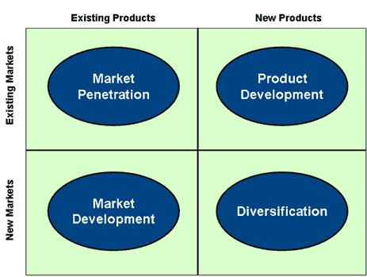
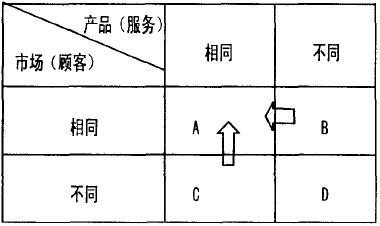
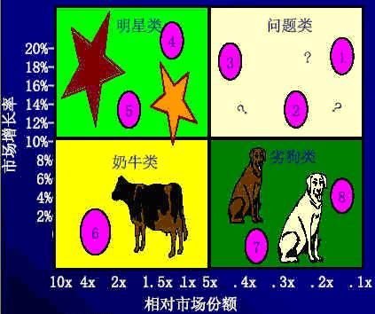
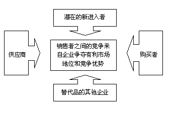
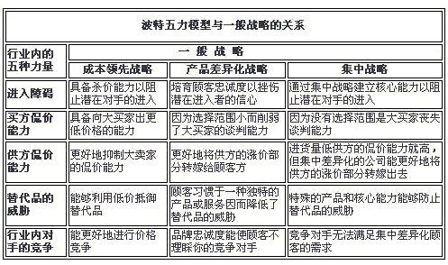
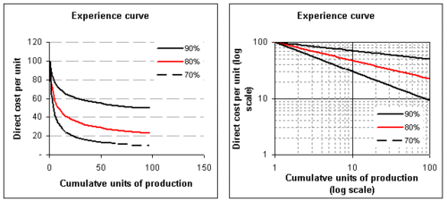
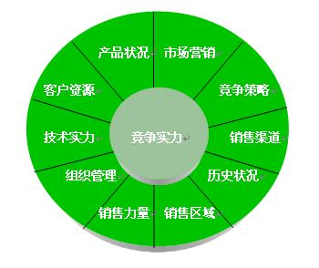
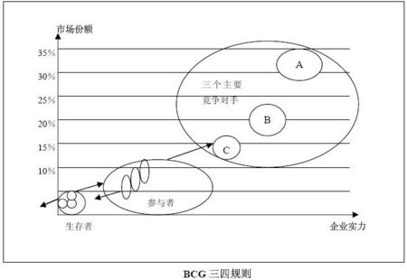
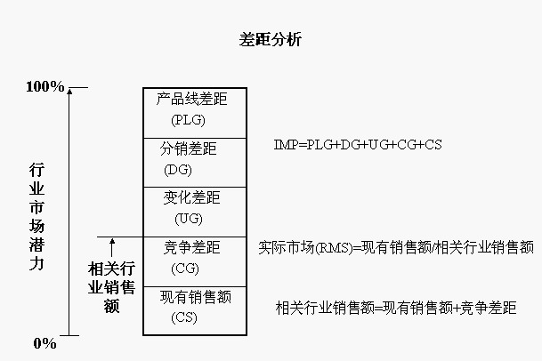

# 商业咨询分析常用工具
经常与客户交流中需要用到的理论模型，可以帮助更好地解释问题，找到问题的根源所在.

[TOC]

## 安索夫矩阵(Ansoff Matrix)
- 以产品和市场作为两大基本面向，区别出四种产品／市场组合和相对应的营销策略，是应用最广泛的营销分析工具之一。
- 以2 X 2的矩阵代表企业企图使收入或获利成长的四种选择

1、市场渗透（Market Penetration）——以现有的产品面对现有的顾客，以其目前的产品市场组合为发展焦点，力求增大产品的市场占有率。采取市场渗透的策略，藉由促销或是提升服务品质等等方式来说服消费者改用不同品牌的产品，或是说服消费者改变使用习惯、增加购买量。

2、市场开发（Market Development）——提供现有产品开拓新市场，企业必须在不同的市场上找到具有相同产品需求的使用者顾客，其中往往产品定位和销售方法会有所调整，但产品本身的核心技术则不必改变。

3、产品延伸（Product Development）——推出新产品给现有顾客，采取产品延伸的策略，利用现有的顾客关系来借力使力。通常是以扩大现有产品的深度和广度，推出新一代或是相关的产品给现有的顾客，提高该厂商在消费者荷包中的占有率。

4、多样化经营（Diversification）——提供新产品给新市场，此处由于企业的既有专业知识能力可能派不上用场，因此是最冒险的多样化策略。其中成功的企业多半能在销售、通路或产品技术等know-how上取得某种综效（Synergy），否则多样化的失败机率很高。

5 、市场巩固（Consolidation）—— 以现有的市场和产品为基础，以巩固市场份额为目的，采用产品差异化战略来加强客户忠诚度。同时，当市场份额总体有所下降时，缩小规模和缩减部门成为不可避免的应对措施。通常，Consolidation在安索夫矩阵中与Market Penetration占据同一格。

- D类竞争者，是和所研究的高校图书馆相比，提供的服务不同，并且用户也不同的竞争者，因此要短期内成为直接竞争对手很难的，这类竞争者可为**愿望竞争者**。

- C类竞争者，是提供的服务相同，但是用户不同的竞争者，因为市场壁垒的存在，这类竞争者属于**潜在竞争者**，如果市场壁垒一旦消失，这类潜在竞争就会变成直接竞争者(即A类竞争者)。这类竞争者包括其他高校的图书馆和公共同图书馆，随着馆际互借，一些图书馆网上服务的展开，高校图书馆的服务面不再限于本校学生了，开始向其他学校的学生扩展，这种情况下高校图书馆信息服务的市场壁垒就不那么明显了，就容易朝A类竞争者转换。

- B类竞争者，是提供的服务不同，但是用户相同的竞争者，这类竞争者属于**平行竞争者**，如果它要利用同用户建立的关系或建立起来的良好信誉而提供同高校图书馆相同的服务，就会变成直接竞争者。这类竞争者包括书店，信息咨询业，网上书店，搜索引擎和邮件定制等；如书店提供阅览服务，就变成了图书馆的直接竞争对手。

- A类竞争者，是提供的服务相同，用户也相同的竞争者，这类竞争者属于**直接竞争者**，包括数字图书馆，还有B类和C类转化而成的竞争者。

## ADL 矩阵
ADL矩阵的内容其中一个维度是产业的生命周期阶段，另一个维度是企业的竞争地位。

1. 识别行业所处的生命周期

-　产业的生命周期分为萌芽阶段、增长阶段、成熟阶段和衰退阶段四个阶段。各阶段由外部因素所决定，它们包括：市场的增长率、增长的可能性、产品线的宽度、竞争者的数量、竞争者市场占有率的分布、顾客的忠诚度、进入障碍和技术。这些要素的均衡决定了企业产业的生命周期阶段。

-　不同生命周期阶段的产业具有不同的特点。处于萌芽期时，产业具有市场增长率较高、竞争者市场占有率分布分散而且变动较快、市场中几乎没有顾客的忠诚度、进人障碍低等特征。产业处于增长阶段时，具有高速增长，用户、市场占有率的技术渐趋明朗和稳定，进入障碍提升等特征。产业处于成熟阶段具有增长率降低，但仍以较稳定的速度增长，技术、市场稳定，产品线宽度增加，进入障碍高等特征。产业处于衰退阶段具有产品需求降低、停止增长，甚至出现负增长，竞争者数目和产品品种减少等特征。

2. 确定企业的竞争地位：

　　企业的竞争地位从强到弱可分为以下五类：

　　- 统治地位：处于统治地位的企业能够控制竞争者的行为，其战略的制定不受竞争者的影响。

　　- 强势地位：处于强势地位的企业能够遵循自己所选择的战略而不必过多关注竞争对手的行为。

　　- 有利地位：处于有利地位的企业虽不处于主导地位，但这些企业都是居于良好的竞争地位及拥有各自的竞争优势。

　　- 维持地位：处于维持地位的企业具有较好的业绩，能与主要的竞争对手相抗衡，有能够维持其地位的机会。

　　- 软弱地位：处于软弱地位的企业竞争地位弱，优势少，很难长久地与竞争昔相抗衡。

## 安迪·格鲁夫的六力分析模型

他认为影响产业竞争态势的因素分别是:

　　1.现存竞争者的影响力、活力、能力；

　　2.供货商的影响力、活力、能力；

　　3.客户的影响力、活力、能力；

　　4.潜在竞争者的影响力、活力、能力；

　　5.产品或服务的替代方式；

　　6.协力业者的力量

## 波士顿矩阵(BCG Matrix)

- BCG矩阵将组织的每一个战略事业单位（SBUs）标在一种2维的矩阵图上，从而显示出哪个SBUs提供高额的潜在收益，以及哪个SBUs是组织资源的漏斗。BCG矩阵的发明者、波士顿公司的创立者布鲁斯认为“公司若要取得成功，就必须拥有增长率和市场份额各不相同的产品组合。组合的构成取决于现金流量的平衡。”如此看来，BCG的实质是为了通过业务的优化组合实现企业的现金流量平衡。

- （1）明星型业务（Stars，指高增长、高市场份额）
- （2）问题型业务（Question Marks，指高增长、低市场份额）
- （3）现金牛业务（Cash cows，指低增长、高市场份额）
- （4）瘦狗型业务（Dogs，指低增长、低市场份额）

## 标杆分析法的定义

　基准化分析法（benchmarking）就是将本企业各项活动与从事该项活动最佳者进行比较，从而提出行动方法，以弥补自身的不足。benchmarking是将本企业经营的各方面状况和环节与竞争对手或行业内外一流的企业进行对照分析的过程，是一种评价自身企业和研究其他组织的手段，是将外部企业的持久业绩作为自身企业的内部发展目标并将外界的最佳做法移植到本企业的经营环节中去的一种方法。实施benchmarking的公司必须不断对竞争对手或一流企业的产品、服务、经营业绩等进行评价来发现优势和不足。

Benchmarking法的主要作用是：

　　(1)做竞争对手的Benchmarking，有助于确定和比较竞争对手经营战略的组成要素。

　　(2)通过对行业内外一流企业的Benchmarking，可以从任何行业中最佳的企业、公司那里得到有价值的情报，用于改进本企业的内部经营，建立起相应的赶超目标。

　　(3)作跨行业的技术性的Benchmarking，有助于技术和工艺方面的跨行业渗透。

　　(4)通过对竞争对手的Benchmarking，与对客户的需求作对比分析，可发现本公司的不足，从而将市场、竞争力和目标的设定结合在一起。

　　(5)通过对竞争对手的Benchmarking，可进一步确定企业的竞争力、竞争情报、竞争决策及其相互关系，作为进行研究对比的三大基点。

## 波特五力分析模型简介

用于竞争战略的分析，可以有效的分析客户的竞争环境。五力分别是： 
供应商的议价能力、购买者的议价能力、潜在竞争者进入的能力、替代品的替代能力、行业内竞争者现在的竞争能力。
五种力量的不同组合变化 最终影响行业利润潜力变化。

## 波士顿经验
波士顿经验曲线又称经验学习曲线、改善曲线，是一种表示生产成本和总累计产量之间的关系曲线。
指的是越是经常地执行一项任务，每次所需的时间就越少。
一家工厂生产某种产品的数量越多，生产者就能更多地了解了如何生产该产品，从生产中获得的经验也就越来越多。

## 贝恩利润池分析工具（Bain Profit Pools）
为利润池做了如下定义： 在**行业价值链**上，行业在各个环节所赚取的利润总和。 那些视角独特的公司，最容易掘取到行业内的高额利润。
帮助公司经理们聚焦利润增长而非营业收入增长的战略模型。 藏于其后的管理思想是， 制订公司战略时，很多管理者只关注营业收入的增长，因为他们想当然地认为利润会随之而来。但是这种制订战略的方法是极其危险的

- 在低利润行业里识别新的利润来源。
- 思考公司在传统价值链上的位置和角色。
- 在纷繁芜杂的利润池中将重心重新转到传统的利润源。
- 制订一系列高明的产品、定价和经营决策。

## 波特竞争战略轮盘模型

竞争战略轮盘，是一个将公司竞争战略诸关键方面仅以一个简单轮盘来阐明的工具。轮盘中心是公司的总目标，也即关于公司要如何从事竞争及其特定的经济与非经济目标的笼统目标。辐条处理用来达到这些目标的主要经营方针。在轮盘的每一栏目下，应当根据公司的活动筒要说明在该职能范围中的主要经营方针。

战略观念就可用来指导公司的整个行动。正如一个车轮，辐条(方针)出自又反射回轮盘中心(目标)，并且辐条必须相互连接，否则车轮无法转动。

轮盘处是企业的总目标（利润增长、市场份额、社会效应），也即关于企业要如何从事竞争及其特定的经济与非经济目标的笼统目标。

- 各种子目标及其战略围绕着总目标构成战略总体。辐条处是用来达到这些目标的主要经营方针。

- 在轮盘的每一栏目中，应当根据企业的活动简要说明在该职能范围中的主要经营方针。经营方针的具体化所形成的各种战略观念即可用于指导企业的整个行动。

- 这个关系就像一个车轮，轮轴与幅条联成一个整体，轮轴通过幅条而实现其转动。

- 根据企业业务性质的不同，管理层在阐明主要经营方针时会或多或少融入些特色。这些方针一旦具体化，战略观念就可用来指导企业的整个行动。正如一个车轮，辐条(方针)出自轮毂又反射回轮毂目标，并且辐条必须相互连接，否则车轮无法转动。

----
案例分析：

- 客户资源

　　衡量一个企业的客户资源可以从数量和质量两方面来进行。如果一个企业仅仅拥有一个较大的客户数量，但是其客户质量却远远逊于另一个只拥有有限数量的企业时，并不能说第一个企业在客户资源竞争中优于第二个企业。从机顶盒市场上讨论，能够获得类似深圳这样的客户资源将远远胜于几个县级城市。

- 产品状况

　　可以说产品状况是一个企业生产发展不断进步的立足点，如果没有好的产品，一个企业是无法长期在市场上生产的。企业的产品状况可以从企业的产品线、产品质量、以及上游企业的支持力度来考量。
　　
　　产品的质量是一个企业赢得市场竞争最重要的因素之一。现在的机顶盒大多是基础型产品，在产品质量上各家企业差距不大，但是在未来的发展中，谁能够率先研制出优质的高端产品，谁就抢占了市场。

- 市场营销

　　现在市场营销主要是从**产品、价格和渠道**这三个方面来考虑。在产品方面，由于现在的整体转换市场上基础型产品成为主流，产品差异化程度下降，在市场竞争中的地位远不如价格和渠道。价格方面，运营商的资金有限，自然希望能够用最低的价位获得相应的产品，因此产品的价格优势将会在极大的程度上左右着营销优势。

- 市场竞争策略

　　所谓的市场竞争策略并不是针对所有企业的，而是仅仅针对本企业最大的竞争对手所制定的竞争策略。

　　在机顶盒市场上，不同的企业有自己不同的竞争对手，随着市场的发展和企业的不断发展，其竞争对手也有可能出现变化。

- 历史状况

　　所谓企业的历史状况也就是企业在本行业的发展历程。在前面我们提到，目前机顶盒市场上的企业可以分为六类（见厂商的类别），在这六类企业中，发展最好的是前三类企业，即机顶盒的专门生产企业，如同洲、九州等，；传统的家电企业下属的子公司或事业部，如长虹、创维、海尔、康佳等，由IT、通信等高科技行业进入到机顶盒市场中来，如华为、永新同方、中视联等，这些企业大多在广电系统内部有较好的公关关系， 使得企业在现在整体平移的竞争中处于更有利的地位。

- 销售区域

　　产品的销售区域对于企业的竞争力也有很大的影响。中国国土面积很大，地区间的差异也十分的明显，同样的产品在不同的销售区域在竞争力上会有很大的差别。在机顶盒市场上，虽然现在的运营商大多采用了基础型的产品，但是每个地区的运营商还是在产品上有着不同的要求。

- 技术实力

　　考察一个企业的技术实力大多从以下三个方面：一是企业现有的技术实力、二是企业的研发实力、三是企业未来的技术发展方向。一个企业只有拥有雄厚的技术实力，才能够实现产品的不断升级换代，才能够从生产上做到降低产品成本，取得竞争的胜利。

## 波特行业竞争结构分析模型的应用方法
管理者从定性和定量两个方面分析行业竞争结构和竞争状况，以达到以下两个目的：

1. 分析确定五力中影响企业成败的关键因素
2. 企业高层管理者从与这一集团因素相关的各因素中找出需要立即对付或处理的威胁，以便及时采取行动。

- 波特行业竞争结构分析模型的应用方法
分析确定五力（潜在的进入者、供应者、购买者、替代产品、行业内的竞争者）中哪一个是影响企业成败的关键集团

竞争结构分析模型:

1. 潜在进入者

| 各种竞争力量| 坚决同意	 | 一般同意	 | 不同意也,不反对 | 一般反对 | 坚决反对 |
|----------------------|:-------:|:-------:|:----------:|:------:|:------:|
| 进入这个行业的成本很高	     | 1| 2 |3 | 4| 5  |
| 我们的产品有很大的差异性	     | |   |     |     |    |
| 需要大量资本才能进入这个行业	 |       |       |          |      |      |
| 顾客更换供应者的成本高	     |       |       |          |      |      |
| 取得销售渠道十分困难           |       |       |          |      |      |
| 很难得到政府批准经营与我们同样的产品|       |       |          |      |      |
| 进入这个行业对本企业的威胁性不大	            |       |       |          |      |      |
| 分数=（各项得到的分数之和/所回答的项数）×（第7项的得分）                                    |

2.行业中的竞争者

| 各种竞争力量| 坚决同意	 | 一般同意	 | 不同意也,不反对 | 一般反对 | 坚决反对 |
|----------------------|:-------:|:-------:|:----------:|:------:|:------:|
| 本行业中有许多竞争者     | 1| 2 |3 | 4| 5  |
| 本行业中所有竞争者几乎一样     | |   |     |     |    |
| 产品市场增长缓慢|       |       |          |      |      |
| 本行业的固定成本很高    |       |       |          |      |      |
| 我们的顾客转换供应者十分容易    |       |       |          |      |      |
| 在现有生产能力上再增加十分困难|       |       |          |      |      |
| 本行业没有两个企业是一样的    |       |       |          |      |      |
| 本行业中大部分企业要么成功，要么垮台 |       |       |          |      |      |
| 本行业中大多数企业准备留在本行业  |       |       |          |      |      |
| 分数=（各项得到的分数之和/所回答的项数）×（第7项的得分）                                    |

3.购买者

| 各种竞争力量| 坚决同意	 | 一般同意	 | 不同意也,不反对 | 一般反对 | 坚决反对 |
|----------------------|:-------:|:-------:|:----------:|:------:|:------:|
| 少量顾客购买本企业的大部分产品	     | 1| 2 |3 | 4| 5  |
| 我们的产品占了顾客采购量的大部分	     | |   |     |     |    |
| 本行业大部分企业提供标准化类似的产品 |       |       |          |      |      |
| 顾客转换供应者十分容易	     |       |       |          |      |      |
| 顾客产品的利润率很低          |       |       |          |      |      |
| 我们的一些大顾客可以买下本企业|       |       |          |      |      |
| 本企业产品对顾客产品质量贡献很小	            |       |       |          |      |      |
| 我们的顾客了解我们的企业以及可以赢利多少|       |       |          |      |      |
| 诚实的说，顾客对本企业的供应者影响很小        |       |       |          |      |      |
| 分数=（各项得到的分数之和/所回答的项数）×（第7项的得分）                                    |

4.替代产品

| 各种竞争力量| 坚决同意	 | 一般同意	 | 不同意也,不反对 | 一般反对 | 坚决反对 |
|----------------------|:-------:|:-------:|:----------:|:------:|:------:|
| 与我们产品用途相近似的产品很多    | 1| 2 |3 | 4| 5  |
| 其它产品有和我们产品相同的功能和较低的成本     | |   |     |     |    |
| 生产和我们产品功能相同产品的企业在其他市场有很大利润|       |       |          |      |      |
| 我们非常关心与我们产品功能相同的其它种类的产品     |       |       |          |      |      |
| 分数=（各项得到的分数之和/所回答的项数）×（第7项的得分）                                    |

## BCG三四规则矩阵
这个模型用于分析一个成熟市场中企业的竞争地位。

在一个稳定的竞争市场中，参与市场竞争的参与者一般分为三类，领先者、参与者、生存者。

- 领先者一般是指市场占有率在15％以上，可以对市场变化产生重大影响的企业，如在价格、产量等方面；
- 参与者一般是指市场占有率介于5％～15％之间的企业，这些企业虽然不能对市场产生重大的影响，但是它们是市场竞争的有效参与者；
- 生存者一般是局部细分市场填补者，这些企业的市场份额都非常低，通常小于5％。
- 最终导致这样的市场份额序列：每个竞争者的市场份额都是紧随其后的竞争者的1.5倍，而最小的竞争者的市场份额不会小于最大者的1/4。

在经验曲线的效应下，**成本是市场份额的函数**。倘若两个竞争者拥有几乎相同的市场份额，那么，谁能提高相对市场份额，谁就能同时取得在产量和成本两个方面的增长；与所付出的代价相比，得到的可能会更多。但是对市场竞争的领先者而言，可能得到的好处却反而少了。然而在任何主要竞争者的激烈争夺情况下，最有可能受到伤害的却是市场中最弱下的生存者。

1. **战略意义**：在有大量竞争者存在的情况下，如果没有外力的约束和控制，大浪淘沙的竞争局面将不可避免，对手越来越少，即使只是为了保持相对市场份额，竞争者的增长也必须超过市场增长的速度；如果不顾一切地想求得增长，那么最终失败者的现金流出将会与日俱增，所有竞争者，除了市场份额最多的两个以外，或者将以失败告终，被完全逐出市场，或者变成现金的无底洞，虽然有时也会取得一些利润，但却要不停地追加投资；所占份额在整个相关市场的30％以下，或者达到了领先者的1／2及以上时，竞争者维持现状的风险将会很大；越早实现投资利润、越早取得仅次于领先者的市场地位，竞争者的风险就越低，可能获得的投资回报也就越高；相关市场及其进入障碍的界定，是重要的战略评估因素；市场领先者对投资策略的了解与熟悉程度以及对待市场份额的态度非常重要。

2. **战术意义**：如果低成本的市场领先者把价格定得太高了，淘汰进程就将推迟发生，但市场领先者将会逐步丧失市场份额，直到它再也不成其为一个领先者，产业增长越快，淘汰也就越快；两个市场份额相当的市场领先者将会把其他所有竞争者淘汰出局，除非它们联手维持价格水平，从而一起丢掉市场份额。要知道淘汰是否已经发生，价格／经验曲线是极好的指示器。如果价格曲线的坡度达到了90％，或者更平坦一些的话，那么领先者可能正在丢掉市场，但却还死守着高价不放。如果曲线的坡度从90％或更高急剧转为80％或更低，那么淘汰将不断进行，直到“三四律”得到满足为止。市场领先者掌握着主动权。如果它珍视市场份额，就没有人能够取代它的地位，除非它缺乏维持生产能力的资金。然而，为了维护短期的营运利润，很多市场领先者都在无意之中割让了市场份额。

## 差距分析
指在战略实施的过程中，将客户实际业绩与战略期望的业绩进行对比分析，进行战略的评价与修订。

最初提出的预测依赖于四个假设：

　　1．公司的业务组合保持不变。

　　2．在公司的产品和市场上取胜的竞争战略将继续一如既往地发展。

　　3．对公司市场的需求和盈利机会将沿着历史趋势发展。

　　4．公司自身对各个业务采取的战略将会沿着历史演变模式发展。

- 产品线差距。缩小这一差距需要从宽度或深度方面完善产品线，并引进新产品或改进产品。如产品线的生产能力不能够满足北京汽车市场的需求。

- 分销差距。可以通过扩展分销覆盖范围、提高分销密集程度和商品陈列缩小这一差距。

- 变化差距。客户使用这一战略的目的是鼓励没有使用过该产品的人试用，而鼓励现有的使用者消费更多的产品，较多购买者在考虑购买‘别克’公司的汽车

- 竞争差距。可以通过从现有竞争者手中夺取额外的市场份额，改善公司的地位，从而弥补这种差距。

　　如果预期的差距不能通过降低行业的市场潜力或得到额外的市场份额来弥补，就应将注意力转向评价公司的业务组合，目的是修改公司业务组合，增长成长率更高的业务，并剥离成长率低的业务。

## 定位

定位四步法

为验证与发展定位，特劳特与他的合作伙伴艾・里斯也花了20多年，在具体运用上刚好也是四步工作法。

1. 第一步，分析整个外部环境，确定“我们的竞争对手是谁，竞争对手的价值是什么”（这与德鲁克在回答管理第一问“我们的业务是什么，应该是什么”时问的“我们的顾客是谁，顾客的价值是什么”相反，因过多的选择、有限的心智，决定了经营方式已从顾客导向转向了竞争导向）。
2. 第二步，避开竞争对手在顾客心智中的强势，或是利用其强势中蕴含的弱点，确立品牌的优势位置—定位。
3. 第三步，为这一定位寻求一个可靠的证明—信任状。
4. 第四步，将这一定位整合进企业内部运营的方方面面，特别是传播上要有足够多的资源，以将这一定位植入顾客的心智（详见定位经典丛书之《与众不同》[[3\]](https://calibre-internal.invalid/index.html#filepos53612)）。

## MKT skills

1. sales skills
2. Social media skills
3. Journalism/ storytelling skills
4. process design skills
5. Data/analytics skills
6. Domain expertise
7. collaboration and exceptional communication
8. Creativity innovation
9. leadership

----

1. Analysis
2. Selling
3. Prioritisation
4. Story telling
5. Technical skills

----

- Skill Development

- selection / deselection of talent with those same skills

- Buyer's perspective

- Selling process

- Planning and measurement
